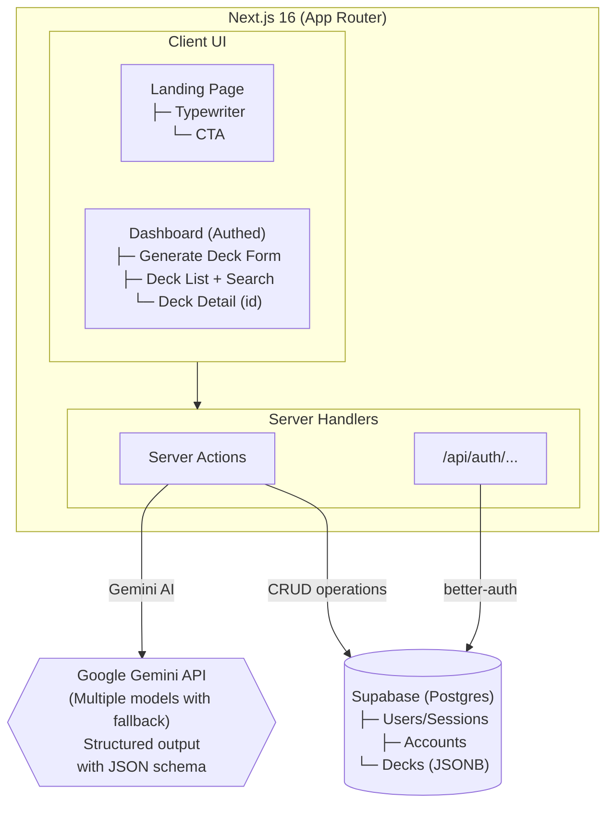

# 🃏 VibeCards

> AI-powered flashcard generator that turns any topic into personalized study decks using Google Gemini, built with Next.js 16 and deployed on Vercel.

## 💡 Why This Exists

Traditional flashcard apps require users to manually write every card—a time-consuming barrier that discourages consistent study habits. VibeCards removes that friction by leveraging **Google Gemini** (with robust model fallbacks) to generate entire study decks from a single topic prompt in seconds.

Users simply type a topic (e.g., "Photosynthesis"), select a difficulty level, and receive a structured deck of flashcards they can immediately study, save, and revisit.

## 🏗️ Architecture



| Layer              | Component                     | Purpose                                                                                                                                      |
| ------------------ | ----------------------------- | -------------------------------------------------------------------------------------------------------------------------------------------- |
| **Frontend**       | Next.js 16 App Router         | Server-rendered pages with React 19, CSS Modules, and Tailwind CSS v4                                                                        |
| **Authentication** | better-auth                   | Email/password + OTP verification + Google OAuth, session management                                                                         |
| **AI Generation**  | Google Gemini                 | Structured JSON output with Zod schema validation, utilizing an automatic 8-model fallback hierarchy (3.1 down to 1.5) for high reliability. |
| **Database**       | Supabase PostgreSQL + Drizzle | Type-safe ORM with Row-Level Security policies on decks                                                                                      |
| **Forms**          | TanStack Form                 | Type-safe form management with Zod validation                                                                                                |
| **Email**          | Resend                        | Transactional emails for OTP verification and password resets                                                                                |

## 🛠️ Tech Stack

| Category        | Technology                                                                                                |
| --------------- | --------------------------------------------------------------------------------------------------------- |
| Framework       | [Next.js](https://nextjs.org/) 16 (App Router) with [React](https://react.dev/) 19                        |
| Language        | [TypeScript](https://www.typescriptlang.org/) (ESNext - strict mode)                                      |
| Runtime         | [Node.js](https://bun.sh/) ≥ 24.14                                                                        |
| Styling         | [Tailwind CSS](https://tailwindcss.com/) v4, CSS Modules                                                  |
| UI Components   | [Radix UI](https://www.radix-ui.com/) primitives, [shadcn/ui](https://ui.shadcn.com/), Lucide React icons |
| Authentication  | [better-auth](https://www.better-auth.com/) (Email OTP + Google OAuth)                                    |
| Database        | [Supabase](https://supabase.com/) (PostgreSQL) via [Drizzle ORM](https://orm.drizzle.team/)               |
| AI              | [Google Gemini](https://ai.google.dev/) (structured output)                                               |
| Forms           | [TanStack Form](https://tanstack.com/form) with [Zod](https://zod.dev/) validation                        |
| Email           | [Resend](https://resend.com/) (transactional OTP & verification emails)                                   |
| Env Validation  | [T3 Env](https://env.t3.gg/) + [Zod](https://zod.dev/)                                                    |
| Logging         | [Pino](https://getpino.io/) (clean, structured logging)                                                   |
| Analytics       | [Vercel Analytics](https://vercel.com/analytics)                                                          |
| Unit Testing    | [Vitest](https://vitest.dev/) + React Testing Library (jsdom, Istanbul coverage)                          |
| E2E Testing     | [Playwright](https://playwright.dev/) (Chromium, Firefox, WebKit, Mobile Chrome)                          |
| Code Quality    | ESLint, Prettier, Husky, lint-staged                                                                      |
| Package Manager | [pnpm](https://pnpm.io/) 10.30.1                                                                          |

## 🚀 Getting Started

### ✅ Prerequisites

| Tool                           | Version      |
| ------------------------------ | ------------ |
| [pnpm](https://pnpm.io/)       | `>= 10.30.1` |
| [Node.js](https://nodejs.org/) | `>= 24.14`   |

### 📦 Installation

```bash
# Clone the repository
git clone <repository-url>
cd vibecards

# Install dependencies
pnpm install --frozen-lockfile
```

### ⚙️ Configuration

Copy the example environment file and fill in the required values:

```bash
cp .env.example .env.local
```

| Variable                       | Description                                                        |
| ------------------------------ | ------------------------------------------------------------------ |
| `NEXT_PUBLIC_APP_URL`          | Public-facing URL of the app (defaults to `http://localhost:3000`) |
| `NODE_ENV`                     | `development` or `production`                                      |
| `GOOGLE_GENERATIVE_AI_API_KEY` | API key for Google Gemini                                          |
| `BETTER_AUTH_SECRET`           | Secret key for better-auth session encryption                      |
| `BETTER_AUTH_URL`              | better-auth base URL (defaults to `http://localhost:3000`)         |
| `DATABASE_URL`                 | Supabase PostgreSQL connection string                              |
| `GOOGLE_CLIENT_ID`             | Google OAuth client ID                                             |
| `GOOGLE_CLIENT_SECRET`         | Google OAuth client secret                                         |
| `RESEND_API_KEY`               | API key for Resend transactional email                             |

> [!NOTE]
> Environment variables are validated at startup using [T3 Env](https://env.t3.gg/) with Zod schemas (see [`env.ts`](src/lib/env.ts)). Missing or invalid values will cause an immediate, descriptive error.

### 🛢️ Database Setup

Push the Drizzle schema to your Supabase database:

```bash
pnpm run db:push
```

## 🧑‍💻 Usage

**Run the development server** (uses Bun runtime):

```bash
pnpm run dev
```

**Build for production:**

```bash
pnpm run build
```

**Start the production server:**

```bash
pnpm run start
```

**View the database** (Drizzle Studio):

```bash
pnpm run db:view
```

## 🧪 Testing

### Unit Tests

Unit tests use [Vitest](https://vitest.dev/) with React Testing Library and Istanbul coverage:

```bash
pnpm run test
```

### E2E Tests

End-to-end tests use [Playwright](https://playwright.dev/) and run against the built application on Chromium:

**Playwright configuration** ([`playwright.config.ts`](playwright.config.ts)):

- Parallel: Fully parallel execution
- Retries: 2 on CI, 0 locally
- Artifacts: Screenshots on failure, video retained on failure, traces on first retry
- Viewport: 1280 × 720 (desktop)

## 📂 Project Structure

```
vibecards/
├── src/
│   ├── app/
│   │   ├── (auth)/                   # Authentication route group
│   │   │   ├── sign-in/
│   │   │   ├── sign-up/
│   │   │   └── verify-otp/
│   │   ├── (cards)/                  # Main application route group
│   │   │   ├── dashboard/            # Generator and stats
│   │   │   │   ├── _components/      # Dashboard-specific components
│   │   │   │   ├── generate-deck.ts  # Server Action for generation
│   │   │   │   └── page.tsx
│   │   │   ├── deck/[id]/            # Individual deck viewer
│   │   │   └── my-decks/             # User's deck collection
│   │   │       ├── delete-deck.ts    # Server Action for deletion
│   │   │       └── page.tsx
│   │   ├── (legal)/                  # Legal pages (TOS, privacy)
│   │   ├── api/
│   │   │   └── auth/[...all]/        # better-auth catch-all route
│   │   ├── layout.tsx                # Root layout
│   │   ├── page.tsx                  # Landing page
│   │   └── globals.css               # Tailwind v4 styles
│   ├── components/
│   │   ├── auth/                     # Reusable auth forms (TanStack Form)
│   │   ├── deck/                     # Deck-related UI components
│   │   ├── header/                   # App header with NavButtons
│   │   ├── footer/                   # App footer
│   │   └── ui/                       # shadcn/ui shared components
│   ├── database/
│   │   ├── schema.ts                 # Drizzle schema definitions
│   │   ├── relations.ts              # Drizzle table relations
│   │   └── db.ts                     # Database client
│   ├── lib/
│   │   ├── auth.ts                   # better-auth configuration
│   │   ├── env.ts                    # T3 Env validation
│   │   ├── mailer.ts                 # Resend integration
│   │   └── pino.ts                   # Structured logger
│   └── hooks/                        # Custom React hooks
├── tests/
│   ├── e2e/                          # Playwright tests + global.setup.ts
│   └── unit/                         # Vitest unit tests
├── playwright.config.ts              # Playwright configuration
├── vitest.config.ts                  # Vitest configuration
├── drizzle.config.ts                 # Drizzle configuration
├── next.config.js                    # Next.js configuration
├── package.json
└── .env.example                      # Environment template
```
