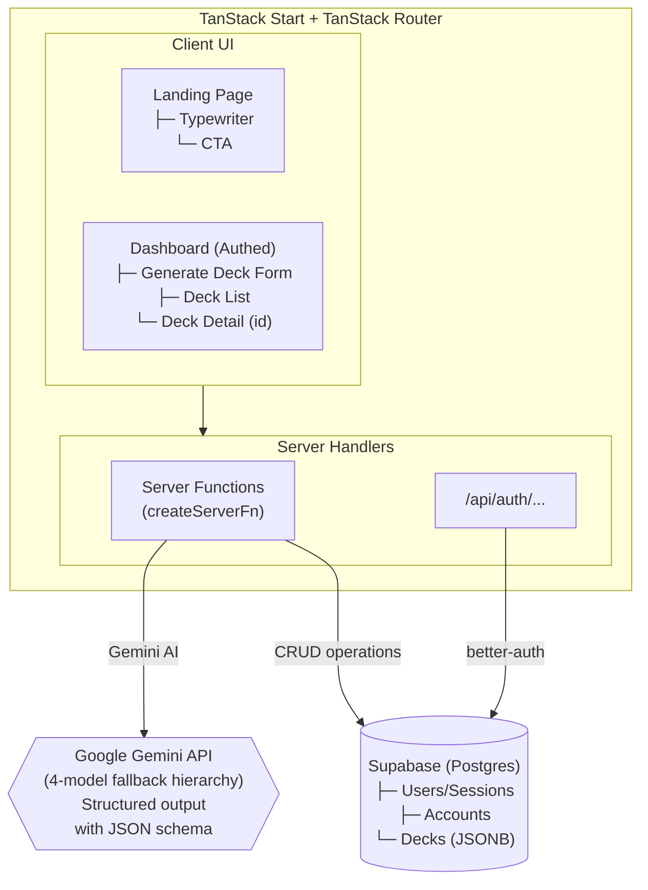

# 🃏 VibeCards

> AI-powered flashcard generator that turns any topic into personalized study decks using Google Gemini, built with TanStack Start (Vite) and deployed as a full-stack SSR app.

## 💡 Why This Exists

Traditional flashcard apps require users to manually write every card—a time-consuming barrier that discourages consistent study habits. VibeCards removes that friction by leveraging **Google Gemini** (with automatic model fallbacks) to generate entire study decks from a single topic prompt in seconds.

Users simply type a topic (e.g., "Photosynthesis"), select a difficulty level, and receive a structured deck of flashcards they can immediately study, save, and revisit.

## 🏗️ Architecture


```mermaid
flowchart TD
    subgraph TanStack["TanStack Start + TanStack Router"]
        direction TB

        subgraph Pages["Client UI"]
            direction LR
            Landing["Landing Page<br/>├─ Typewriter<br/>└─ CTA"]
            Dashboard["Dashboard (Authed)<br/>├─ Generate Deck Form<br/>├─ Deck List<br/>└─ Deck Detail (id)"]
        end

        subgraph Server["Server Handlers"]
            direction LR
            ServerFns["Server Functions<br/>(createServerFn)"]
            AuthAPI["/api/auth/..."]
        end

    Pages --> Server
    end

    Supabase[("Supabase (Postgres)<br/>├─ Users/Sessions<br/>├─ Accounts<br/>└─ Decks (JSONB)")]
    Gemini{{"Google Gemini API<br/>(4-model fallback hierarchy)<br/>Structured output<br/>with JSON schema"}}

    ServerFns -- "Gemini AI" ---> Gemini
    AuthAPI -- "better-auth" ---> Supabase
    ServerFns -- "CRUD operations" ---> Supabase
```

| Layer              | Component                     | Purpose                                                                                                                                 |
| ------------------ | ----------------------------- | --------------------------------------------------------------------------------------------------------------------------------------- |
| **Frontend**       | TanStack Start (Vite)         | File-based routing with React 19, Tailwind CSS v4, server functions                                                                     |
| **Authentication** | better-auth                   | Email/password + OTP verification + Google OAuth, session management                                                                    |
| **AI Generation**  | Google Gemini                 | Structured JSON output with Zod schema validation; 4-model fallback hierarchy (2.5-flash → 2.5-flash-lite → 2.0-flash → 2.0-flash-lite) |
| **Database**       | Supabase PostgreSQL + Drizzle | Type-safe ORM with Row-Level Security policies on decks                                                                                 |
| **Forms**          | TanStack Form                 | Type-safe form management with Zod validation                                                                                           |
| **Email**          | Resend                        | Transactional emails for OTP verification and password resets                                                                           |

## 🛠️ Tech Stack

| Category        | Technology                                                                                                                                                         |
| --------------- | ------------------------------------------------------------------------------------------------------------------------------------------------------------------ |
| Framework       | [TanStack Start](https://tanstack.com/start) + [TanStack Router](https://tanstack.com/router) with [React](https://react.dev/) 19                                  |
| Language        | [TypeScript](https://www.typescriptlang.org/) (ESNext - strict mode)                                                                                               |
| Runtime         | [Bun](https://bun.sh/) `>= 1.3.13`                                                                                                                                 |
| Styling         | [Tailwind CSS](https://tailwindcss.com/) v4, CSS Modules                                                                                                           |
| UI Components   | [Radix UI](https://www.radix-ui.com/) primitives, [shadcn/ui](https://ui.shadcn.com/), Lucide React icons                                                          |
| Authentication  | [better-auth](https://www.better-auth.com/) (Email OTP + Google OAuth)                                                                                             |
| Database        | [Supabase](https://supabase.com/) (PostgreSQL) via [Drizzle ORM](https://orm.drizzle.team/)                                                                        |
| AI              | [TanStack AI](https://tanstack.com/ai) + Google Gemini provider (structured output)                                                                                |
| Forms           | [TanStack Form](https://tanstack.com/form) with [Zod](https://zod.dev/) validation                                                                                 |
| Email           | [Resend](https://resend.com/) (transactional OTP & verification emails)                                                                                            |
| Env Validation  | [T3 Env](https://env.t3.gg/) + [Zod](https://zod.dev/)                                                                                                             |
| Logging         | [LogTape](https://logtape.org/) + [Sentry](https://sentry.io/) (structured logging with error tracking)                                                            |
| Unit Testing    | [Vitest](https://vitest.dev/) + React Testing Library (jsdom, Istanbul coverage, 70% threshold)                                                                    |
| Integration     | [Vitest](https://vitest.dev/) + Docker Compose (PostgreSQL 16 on port 5433)                                                                                        |
| Code Quality    | [oxlint](https://oxc.rs/docs/guide/usage/linter.html), [oxfmt](https://oxc.rs/docs/guide/usage/formatter.html), Lefthook, GitHub Actions (CI/CD), Gitleaks, CodeQL |
| Package Manager | [Bun](https://bun.sh/) `bun@1.3.13`                                                                                                                                |

## 🚀 Getting Started

### ✅ Prerequisites

| Tool                   | Version                           |
| ---------------------- | --------------------------------- |
| [Bun](https://bun.sh/) | `>= 1.3.13` (`bun@1.3.13` pinned) |

### 📦 Installation

```bash
# Clone the repository
git clone <repository-url>
cd vibecards

# Install dependencies
bun install
```

### ⚙️ Configuration

Copy the example environment file for local development and fill in the required values:

```bash
cp .env.example .env.local
```

Local database, auth, and integration test workflows load `.env.local`. CI copies `.env.example` to `.env` for automated checks.

| Variable                       | Description                                                        |
| ------------------------------ | ------------------------------------------------------------------ |
| `VITE_APP_URL`                 | Public-facing URL of the app (defaults to `http://localhost:3000`) |
| `VITE_SENTRY_DSN`              | Sentry DSN for error tracking (optional; disables Sentry if unset) |
| `NODE_ENV`                     | `development` or `production`                                      |
| `GOOGLE_GENERATIVE_AI_API_KEY` | API key for Google Gemini                                          |
| `BETTER_AUTH_SECRET`           | Secret key for better-auth session encryption                      |
| `BETTER_AUTH_URL`              | better-auth base URL (defaults to `http://localhost:3000`)         |
| `DATABASE_URL`                 | Supabase PostgreSQL connection string                              |
| `GOOGLE_CLIENT_ID`             | Google OAuth client ID                                             |
| `GOOGLE_CLIENT_SECRET`         | Google OAuth client secret                                         |
| `RESEND_API_KEY`               | API key for Resend transactional email                             |
| `TEST_EMAIL`                   | Verified email address for testing (optional)                      |
| `TEST_PASSWORD`                | Password for the test email account used in testing (optional)     |

> [!NOTE]
> Environment variables are validated at startup using [T3 Env](https://env.t3.gg/) with Zod schemas (see [`env.ts`](src/lib/env.ts)). Missing or invalid values will cause an immediate, descriptive error.

### 🛢️ Database Setup

Push the Drizzle schema to your Supabase database:

```bash
bun run db:push
```

## 🧑‍💻 Usage

**Run the development server**:

```bash
bun run dev
```

**Build for production:**

```bash
bun run build
```

**Start the production server:**

```bash
bun run start
```

**View the database** (Drizzle Studio):

```bash
bun run db:view
```

## 🧪 Testing

### Unit Tests

Unit tests use [Vitest](https://vitest.dev/) with React Testing Library and Istanbul coverage (70% thresholds):

```bash
bun run test:unit
```

### Integration Tests

Integration tests use [Vitest](https://vitest.dev/) and run against an isolated PostgreSQL database managed by Docker Compose (`compose.yml` on port `5433`):

```bash
# Start test database (if not running)
docker compose up -d

# Run integration tests
bun run test:integration
```

**Vitest Configuration** ([`vitest.config.ts`](vitest.config.ts)):

- **Unit project**: Runs in `jsdom` environment covering frontend and UI components.
- **Integration project**: Runs in `node` environment against local PostgreSQL on port 5433 with global database reset and seeding ([`tests/integration/setup.ts`](tests/integration/setup.ts)).
- **Coverage thresholds**: Enforces 70% minimum coverage across lines, branches, and functions using the Istanbul provider.

## 📂 Project Structure

```
vibecards/
├── instrument.server.mjs            # Sentry + LogTape bootstrap (loaded before app via NODE_OPTIONS)
├── src/
│   ├── start.ts                     # TanStack Start instance, Sentry + logger middleware
│   ├── server.ts                    # Nitro server entry point, Sentry fetch wrapper
│   ├── router.tsx                   # Router factory, client-side Sentry + LogTape init
│   ├── routeTree.gen.ts             # Auto-generated route tree (do not edit manually)
│   ├── globals.css                  # Global styles
│   ├── routes/
│   │   ├── __root.tsx               # Root document/layout route
│   │   ├── index.tsx                # Landing page
│   │   ├── dashboard.tsx            # Deck generator (auth-guarded)
│   │   ├── my-decks.tsx             # User deck list (auth-guarded)
│   │   ├── deck/$id.tsx             # Individual deck study view (auth-guarded)
│   │   ├── sign-in.tsx              # Sign-in
│   │   ├── sign-up.tsx              # Sign-up
│   │   ├── verify-otp.tsx           # OTP verification
│   │   ├── privacy-policy.tsx       # Privacy policy
│   │   ├── terms-of-service.tsx     # Terms of service
│   │   ├── privacy.tsx              # Redirect → /privacy-policy
│   │   ├── terms.tsx                # Redirect → /terms-of-service
│   │   └── api/
│   │       ├── auth/$.ts            # better-auth wildcard handler
│   │       ├── decks.ts             # Deck list + generate endpoint
│   │       └── decks/$id.ts         # Single deck get/update/delete
│   ├── components/
│   │   ├── auth/                    # Auth forms (login, signup, OTP)
│   │   ├── deck/                    # Deck UI components
│   │   ├── email-templates/         # Resend transactional email templates
│   │   ├── header/                  # App header + nav buttons
│   │   ├── footer/                  # App footer
│   │   ├── landing/                 # Landing page sections
│   │   ├── legal/                   # Legal policy card component
│   │   └── ui/                      # shadcn/ui shared components
│   ├── hooks/                       # Custom React hooks
│   ├── database/
│   │   ├── schema.ts                # Drizzle schema + RLS policy definitions
│   │   └── db.ts                    # Database client
│   ├── lib/
│   │   ├── auth.ts                  # better-auth server configuration
│   │   ├── auth-client.ts           # better-auth React client
│   │   ├── deck-actions.ts          # Client-side deck fetch helpers
│   │   ├── env.ts                   # T3 Env validation
│   │   ├── logger.ts                # LogTape structured logger
│   │   ├── mailer.ts                # Resend integration
│   │   └── validations/             # Zod schemas
│   └── utils/
│       └── authenticate.ts          # Server-side session helper (createServerFn context)
├── tests/
│   ├── integration/                 # Vitest integration tests + database setup
│   └── unit/                        # Vitest unit tests
├── vitest.config.ts                 # Vitest configuration (unit + integration projects)
├── vite.config.ts                   # TanStack Start + Nitro + Sentry Vite plugin
├── compose.yml                      # Docker Compose PostgreSQL service for integration testing
├── package.json
└── .env.example                     # Environment variable template
```
