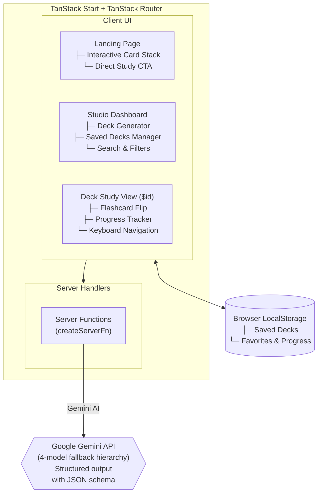

# VibeCards

> AI-powered flashcard generator that turns any topic into personalized study decks using Google Gemini, built with TanStack Start (Vite) and deployed as a full-stack SSR app.

## Why This Exists

Traditional flashcard apps require users to manually write every card—a time-consuming barrier that discourages consistent study habits. VibeCards removes that friction by leveraging **Google Gemini** (with automatic model fallbacks) to generate entire study decks from a single topic prompt in seconds.

Users simply type a topic (e.g., "Photosynthesis"), select a difficulty level, and receive a structured deck of flashcards they can immediately study, save locally, and revisit.

## Architecture


```mermaid
flowchart TD
    subgraph TanStack["TanStack Start + TanStack Router"]
        direction TB

        subgraph Pages["Client UI"]
            direction LR
            Landing["Landing Page<br/>├─ Interactive Card Stack<br/>└─ Direct Study CTA"]
            Dashboard["Studio Dashboard<br/>├─ Deck Generator<br/>├─ Saved Decks Manager<br/>└─ Search & Filters"]
            DeckView["Deck Study View ($id)<br/>├─ Flashcard Flip<br/>├─ Progress Tracker<br/>└─ Keyboard Navigation"]
        end

        subgraph Server["Server Handlers"]
            direction LR
            ServerFns["Server Functions<br/>(createServerFn)"]
        end

    Pages --> Server
    end

    LocalStorage[("Browser LocalStorage<br/>├─ Saved Decks<br/>└─ Favorites & Progress")]
    Gemini{{"Google Gemini API<br/>(4-model fallback hierarchy)<br/>Structured output<br/>with JSON schema"}}

    Pages <--> LocalStorage
    ServerFns -- "Gemini AI" ---> Gemini
```

| Layer             | Component             | Purpose                                                                                                                                 |
| ----------------- | --------------------- | --------------------------------------------------------------------------------------------------------------------------------------- |
| **Frontend**      | TanStack Start (Vite) | File-based routing with React 19, Tailwind CSS v4, server functions                                                                     |
| **Storage**       | Browser LocalStorage  | Local-first, offline persistence for study decks, favorites, and study progress                                                         |
| **AI Generation** | Google Gemini         | Structured JSON output with Zod schema validation; 4-model fallback hierarchy (2.5-flash → 2.5-flash-lite → 2.0-flash → 2.0-flash-lite) |
| **Forms**         | TanStack Form         | Type-safe form management with Zod validation                                                                                           |

## Tech Stack

| Category        | Technology                                                                                                                                                         |
| --------------- | ------------------------------------------------------------------------------------------------------------------------------------------------------------------ |
| Framework       | [TanStack Start](https://tanstack.com/start) + [TanStack Router](https://tanstack.com/router) with [React](https://react.dev/) 19                                  |
| Language        | [TypeScript](https://www.typescriptlang.org/) (ESNext - strict mode)                                                                                               |
| Runtime         | [Bun](https://bun.sh/) `>= 1.3.14`                                                                                                                                 |
| Styling & Fonts | [Tailwind CSS](https://tailwindcss.com/) v4, `@fontsource` (Bricolage Grotesque, Newsreader, JetBrains Mono)                                                       |
| UI Components   | [Radix UI](https://www.radix-ui.com/) primitives, [shadcn/ui](https://ui.shadcn.com/), Lucide React icons                                                          |
| Storage         | Browser [LocalStorage](https://developer.mozilla.org/en-US/docs/Web/API/Window/localStorage) (Local-first deck persistence)                                        |
| AI              | [TanStack AI](https://tanstack.com/ai) + Google Gemini provider (structured output)                                                                                |
| Rate Limiting   | [Upstash Redis REST](https://upstash.com/) (IP sliding-window rate limiting)                                                                                       |
| Forms           | [TanStack Form](https://tanstack.com/form) with [Zod](https://zod.dev/) validation                                                                                 |
| Env Validation  | [T3 Env](https://env.t3.gg/) + [Zod](https://zod.dev/)                                                                                                             |
| Logging         | [LogTape](https://logtape.org/) + [Sentry](https://sentry.io/) (structured logging with error tracking)                                                            |
| Unit Testing    | [Vitest](https://vitest.dev/) + React Testing Library (jsdom, Istanbul coverage, 70% threshold)                                                                    |
| Code Quality    | [oxlint](https://oxc.rs/docs/guide/usage/linter.html), [oxfmt](https://oxc.rs/docs/guide/usage/formatter.html), Lefthook, GitHub Actions (CI/CD), Gitleaks, CodeQL |
| Package Manager | [Bun](https://bun.sh/) `bun@1.3.14`                                                                                                                                |

## Getting Started

### Prerequisites

| Tool                   | Version                           |
| ---------------------- | --------------------------------- |
| [Bun](https://bun.sh/) | `>= 1.3.14` (`bun@1.3.14` pinned) |

### Installation

```bash
# Clone the repository
git clone <repository-url>
cd vibecards

# Install dependencies
bun install
```

### Configuration

Copy the example environment file for local development and fill in the required values:

```bash
cp .env.example .env.local
```

Local environment and CI workflows load `.env.local` or `.env`.

| Variable                       | Description                                                         |
| ------------------------------ | ------------------------------------------------------------------- |
| `VITE_APP_URL`                 | Public-facing URL of the app (defaults to `http://localhost:3000`)  |
| `VITE_SENTRY_DSN`              | Sentry DSN for error tracking (optional; disables Sentry if unset)  |
| `NODE_ENV`                     | `development`, `production`, or `test`                              |
| `GOOGLE_GENERATIVE_AI_API_KEY` | API key for Google Gemini                                           |
| `UPSTASH_REDIS_REST_URL`       | Upstash Redis REST URL for API IP rate-limiting (optional in dev)   |
| `UPSTASH_REDIS_REST_TOKEN`     | Upstash Redis REST token for API IP rate-limiting (optional in dev) |

> [!NOTE]
> Environment variables are validated at startup using [T3 Env](https://env.t3.gg/) with Zod schemas (see [`env.ts`](src/lib/env.ts)). Missing or invalid values will cause an immediate, descriptive error.

## Usage

**Run the development server**:

```bash
bun run dev
```

**Build for production:**

```bash
bun run build
```

**Start the production server:**

```bash
bun run start
```

## Testing

### Unit Tests

Unit tests use [Vitest](https://vitest.dev/) with React Testing Library (`jsdom` environment) and Istanbul coverage (70% thresholds):

```bash
bun run test
```

**Vitest Configuration** ([`vitest.config.ts`](vitest.config.ts)):

- **Unit project**: Runs in `jsdom` environment covering UI components, custom hooks (`useLocalDecks`, `useDeckSearch`), local deck storage (`local-deck-store.ts`), and route handlers.
- **Coverage thresholds**: Enforces 70% minimum coverage across lines, branches, and functions using the Istanbul provider.

## Project Structure

```
vibecards/
├── instrument.server.mjs            # Sentry + LogTape bootstrap (loaded before app via NODE_OPTIONS)
├── nitro.config.ts                  # Nitro server configuration
├── src/
│   ├── start.ts                     # TanStack Start instance, Sentry + logger middleware
│   ├── server.ts                    # Nitro server entry point, Sentry fetch wrapper
│   ├── router.tsx                   # Router factory, client-side Sentry + LogTape init
│   ├── routeTree.gen.ts             # Auto-generated route tree (do not edit manually)
│   ├── globals.css                  # Design tokens, typography variables & global styles
│   ├── routes/
│   │   ├── __root.tsx               # Root document/layout route
│   │   ├── index.tsx                # Landing page with card stack preview & CTA
│   │   ├── dashboard.tsx            # Unified deck generator & saved decks studio
│   │   ├── deck/
│   │   │   └── $id.tsx              # Interactive deck study view
│   │   └── api/
│   │       └── decks.ts             # Stateless deck generate server endpoint
│   ├── components/
│   │   ├── deck/                    # Study view, controls, progress, empty & completion states
│   │   ├── header/                  # App navigation header
│   │   ├── ui/                      # shadcn/ui & radix primitives
│   │   └── theme-provider.tsx       # NextThemes provider
│   ├── hooks/                       # Custom React hooks (useLocalDecks, useDeckSearch, etc.)
│   └── lib/
│       ├── local-deck-store.ts      # LocalStorage persistence & Zod validation
│       ├── env.ts                   # T3 Env validation
│       ├── logger.ts                # LogTape structured logger
│       ├── utils.ts                 # Styling & helper utilities
│       └── validations/             # Zod validation schemas
├── tests/
│   └── unit/                        # Vitest unit test suite
├── vitest.config.ts                 # Vitest configuration (Istanbul coverage)
├── vite.config.ts                   # TanStack Start + Nitro + Sentry Vite plugin
├── package.json
└── .env.example                     # Environment variable template
```
